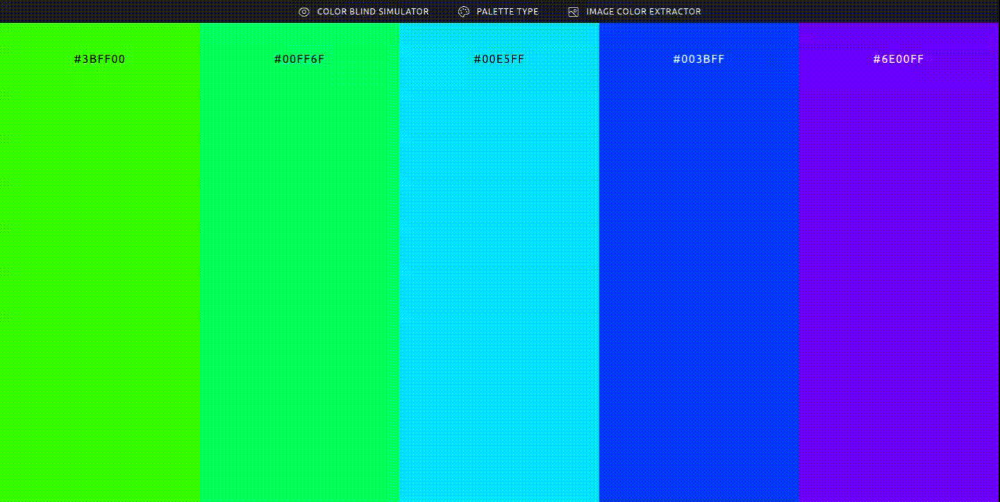
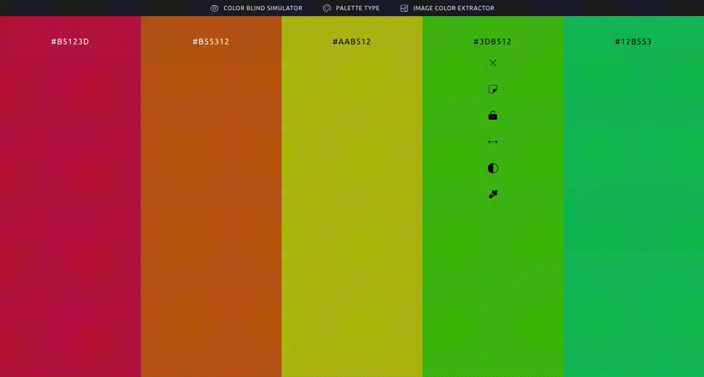
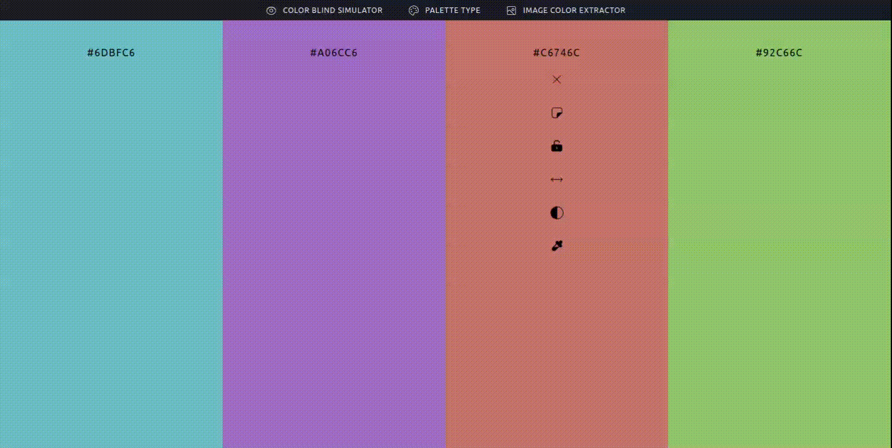
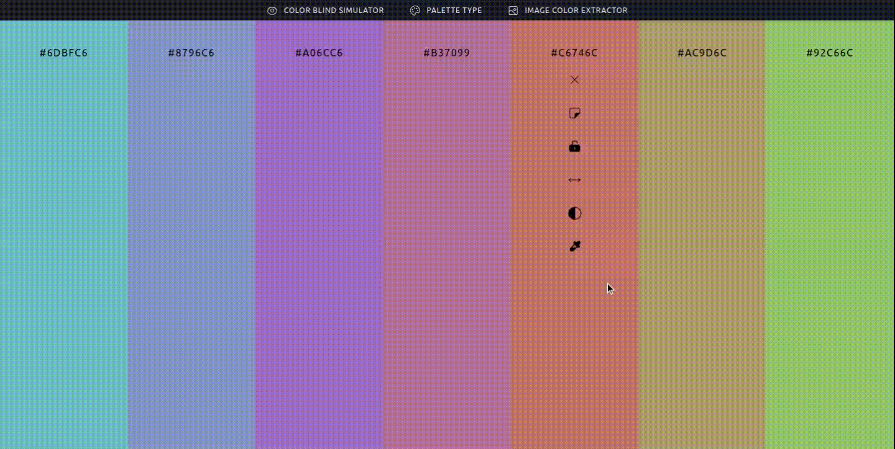
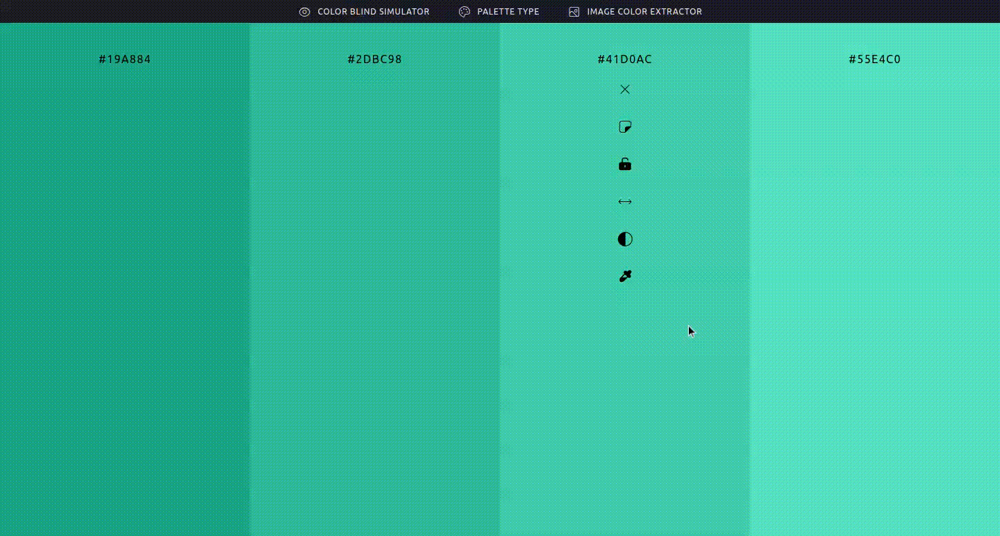
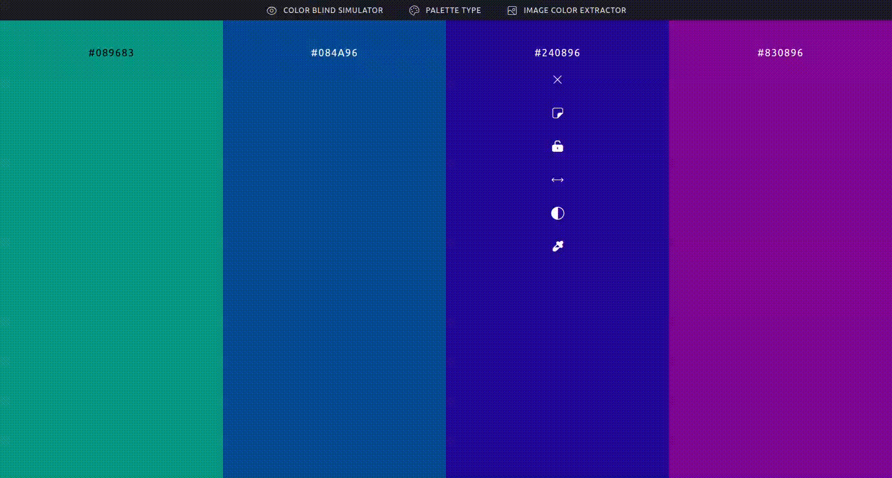
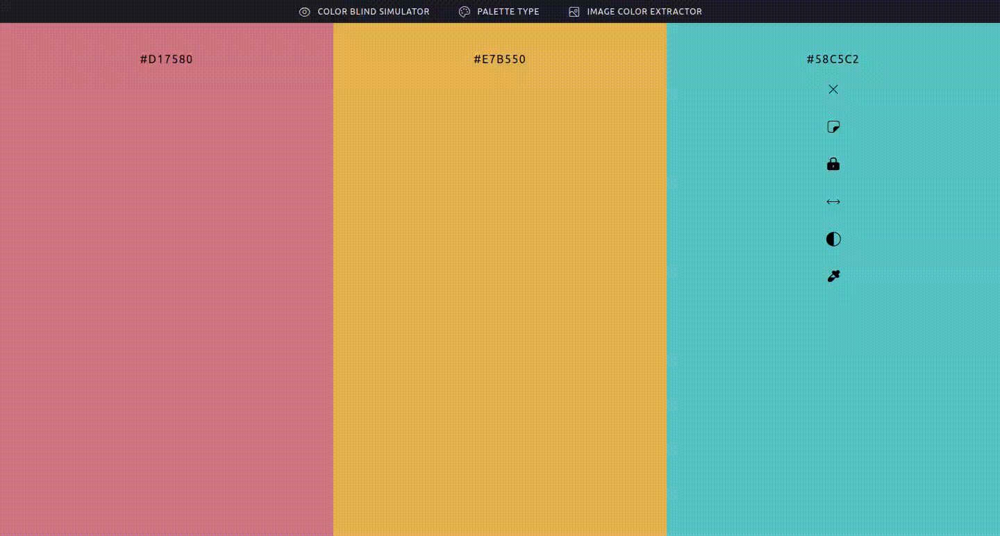
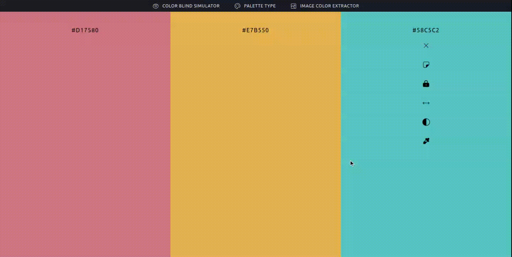

# Palette

Palette is a web app built using the new [colors-kit](https://github.com/monoald/colors-kit) package. This project is an **open-source** "clone" of the web app "coolors.co". Its purpose is to encourage the community to contribute and add features that they find useful or relevant to specific niches. By doing so, Palette aims to provide a platform that caters to the diverse needs of its users.

## Contribute

If you are interested in contributing to this project, please don't hesitate to do so! There are two ways you can contribute: you can add new features directly to this repository, or you can enhance the [colors-kit](https://github.com/monoald/colors-kit) package by introducing new methods to use them in new features of **Palette**. Both options are available to help improve the functionality and user experience of the app. Your contributions are greatly appreciated and will make a valuable difference to the project. Feel free to dive in and make your mark!

## Features and Use Guide

Palette offers a wide range of features designed to assist users with their color-related tasks.

### Generate color palettes

The main page of Palette consists of five columns, each representing a different color. To explore a new palette, simply press the **spacebar**, and the app will generate a fresh color palette for you to enjoy. This feature allows for effortless exploration and discovery of vibrant color schemes.

Also, you have the option to select the type of palette you wish to generate.

### Add or delete colors

To add new colors, simply click on the plus (+) icon located at the edge of a color column.

To delete a color, simply hover over a color column, and an 'x' icon will appear. Click on this icon to remove the desired color from your palette.

### Lock and Reorder colors

To personalize the palette you are creating, you can lock colors to avoid its change when the spacebar is pressed. 
Also you can reorder the colors dragging them by the [two side arrow](https://www.google.com/search?sxsrf=APwXEddKiCkn31m5H5b0X58S8FoMe0h5iw:1686952496725&q=two+side+arrow+icon&tbm=isch&sa=X&ved=2ahUKEwiuxMfi48j_AhVTrZUCHb1EDNsQ0pQJegQIERAB&biw=1440&bih=772&dpr=1) icon.

### Modify specific color

Modifying a specific color in Palette is a straightforward process. Clicking on the [eyedropper](https://www.google.com/search?sxsrf=APwXEdd0WVGENZihl8H3PDWsSzXykQusxA:1686951740482&q=eyedropper+icon&tbm=isch&sa=X&ved=2ahUKEwjwjvr54Mj_AhUwDrkGHYvQCOQQ0pQJegQIDBAB&biw=1440&bih=772&dpr=1) icon will open a new window where you can modify the selected color using various formats. Simply choose the format you prefer to edit the color, and easily navigate to the desired color.

### Color contrast

Palette adheres to the Web Content Accessibility Guidelines (WCAG) to ensure optimal contrast rates and meet the specified criteria levels. To access the guidelines, simply click on the palette icon located on a color column. This will provide you with valuable information regarding contrast ratios. Additionally, you have the freedom to select, modify, and even add contrast colors according to your preferences. This user-friendly approach empowers you to create visually appealing designs while considering accessibility principles. Enjoy the flexibility and inclusivity of Palette!

### Simulate color blindness

To enhance the accessibility of your palettes, Palette offers the ability to simulate various types of color blindness. This valuable feature allows you to experience your color choices from the perspective of individuals with different forms of color vision deficiency. By simulating color blindness, you can ensure that your designs remain inclusive and easily comprehensible to a wider audience.

### Extract palettes from images

Palette can help you with that image you love and want to extract its colors to use them on your project. Whether you prefer to drag and drop the image directly into the app or use its URL, Palette provides a seamless process for extracting the desired colors.

